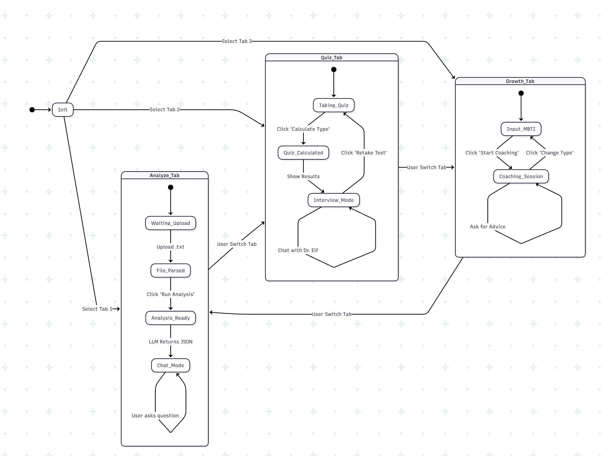
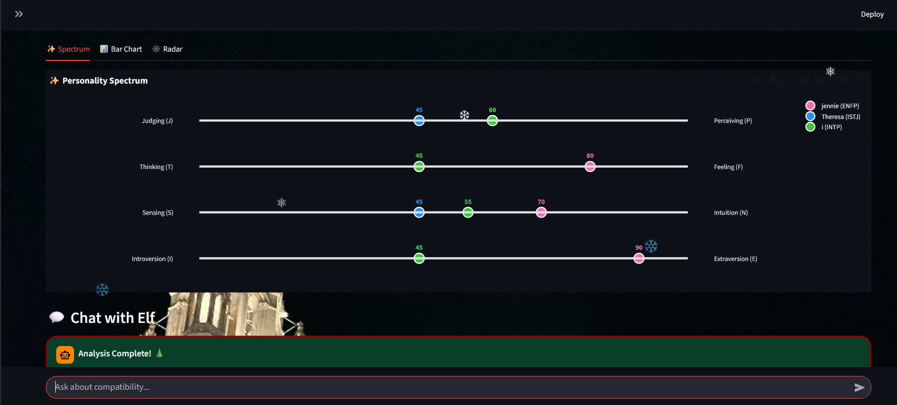
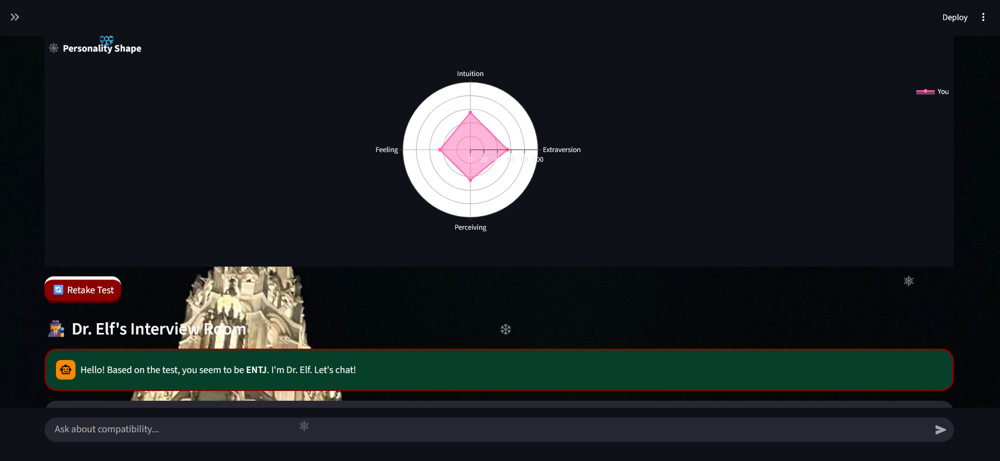

# 🎄 MBTI North Pole

**Analyze personalities, one chat at a time!**

A Streamlit-powered application that transforms your LINE chat history into deep personality insights using Large Language Models (LLMs). Features a festive "North Pole" theme, interactive visualizations, and an AI Elf agent for chat analysis.

## 🛠️ Installation

### Prerequisites
* **Python 3.8+**
* **Ollama** (for local analysis)
* Model requirement: `llama3.2:1b`

### 1. Clone the repository
```bash
git clone https://github.com/ipiangau/MBTI-
cd MBTI-
```
### 2. Install Dependencies
```bash
pip install streamlit plotly requests openai python-dotenv

CREATE .env FILE
API_BASE_URL="https://your-remote-api.com"
API_KEY=your-remote-api-key

LOCAL_OLLAMA_URL="http://localhost:11434"
OLLAMA_API_KEY=ollama 

POLL_API_KEY=sk-...
MAP_API_KEY=
```
### Usage
#### 1. Start the Application:
```bash
streamlit run app.py
```
#### 2. Configure the Agent:
```bash
- Open the Sidebar (⚙️)
- Select your "AI Helper" (Remote NCKU or Local Ollama)
```
#### 3. Start the Application:
```bash
- Upload your LINE chat .txt file
- Select the specific friends you want to analyze from the list
- Click 🚀 Run Analysis
```

### Project Structure
```bash
MBTI-/
├── README.md
├── agent.py
├── app.py       
├── charts.py
├── mbti.py  
├── requirements.txt
└── image/
```
### Technologies
```bash
Remote NCKU API (for the LLM)
Local Ollama API (alternative for the LLM)
pollinations.ai (for the Image Generation)
Google Map API (for places recommendation)
```
### Flow Chart


### FSM


### Description
```bash
This MBTI analysis is applicable in both English and Mandarin
Tab 1: Chat Analysis (Group Chat)
  - Upload a .txt chat history file (LINE/WhatsApp format). The tool automatically detects distinct speakers
  - Select specific participants to analyze. The AI examines their tone, vocabulary, and interaction patterns to estimate their MBTI personality type
  - Chat with Data: ask specific questions about the analysis or generate metaphorical art representing the group dynamic or generate interactive charts or get a recommendation of meeting point 
```
#### ex.chart

```bash
Tab 2: Self-Discovery (MBTI Test)
  - Answer 28 questions
  - Calculates scores across the four dimensions (E/I, S/N, T/F, J/P) and reveals the final MBTI type.
  - Discuss the results, validate the findings, and explore personal strengths/weaknesses
```
#### ex.MBTI result

```bash
Tab 3: Personal Growth Coach
  - Users input their MBTI type
  - Provides tailored advice on career, relationships, place recommendation, and habits based on the cognitive functions of that specific type
  - Users can request motivational visualizations (e.g., "Show me an image of an INFP overcoming procrastination") which are generated on the fly
```
#### ex.Place recommendation
